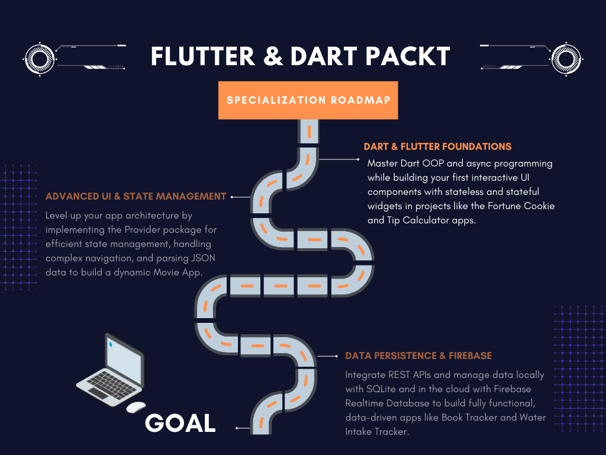

  <h1>🚀 Phase 1: Getting Started with Flutter & Dart</h1>

  

  

  

  

  
<i>The foundational phase of the <b>"Flutter & Dart - Complete App Development"</b> Specialization by Packt. This module documents the journey from zero to a fully configured development environment, mastering Dart fundamentals, and building the first interactive Flutter UIs.</i>

 

 

# 📖 Phase Overview

This course serves as the launchpad into mobile engineering with Flutter. The focus is strictly on understanding the underlying mechanics of the Dart language, setting up a robust development environment, and grasping Flutter's core philosophy: **Everything is a Widget**.

### 🎯 Core Objectives Achieved
- **Environment Configuration:** Complete setup of the Flutter SDK, Visual Studio Code, and Android/iOS Emulators across both Windows and macOS.
- **Dart Fundamentals:** Deep dive into variables, functions, return types, positional/named parameters, and Object-Oriented Programming (OOP) concepts.
- **Widget Architecture:** Understanding the Widget tree, the `build` method, and the critical differences between `StatelessWidget` and `StatefulWidget`.
- **State Management (Basics):** Utilizing `setState()` to trigger UI rebuilds and manage local, ephemeral state.
- **Code Maintainability:** Applying the `const` keyword for performance optimization and refactoring large UI trees into smaller, reusable custom widget classes.

 

 

# 🔥 Hands-On Projects

  <table border="0" cellpadding="15">
    <tr>
      <td width="50%" valign="top">
        <h3><a href="./fortune_cookie">🥠 Fortune Cookie App</a></h3>
        
A foundational app bridging pure Dart concepts with interactive Flutter UIs.

        <b>Key Features & Tech:</b>
        <ul>
          <li>Handling user events & interactivity</li>
          <li>List data randomization in Dart</li>
          <li>Local state via <code>setState()</code></li>
          <li>Local image asset integration</li>
        </ul>
      </td>
      <td width="50%" valign="top">
        <h3><a href="./tip_calculator">💵 Tip Calculator (V1)</a></h3>
        
A robust utility application demonstrating complex UI composition and logic.

        <b>Key Features & Tech:</b>
        <ul>
          <li>User input via <code>TextField</code> & <code>Slider</code></li>
          <li>Dynamic mathematical calculations</li>
          <li>Basic theming using <code>BuildContext</code></li>
          <li>Extensive widget refactoring (OOP)</li>
        </ul>
      </td>
    </tr>
    <tr>
      <td width="50%" align="center" valign="bottom">
        
      </td>
      <td width="50%" align="center" valign="bottom">
        
      </td>
    </tr>
  </table>

 

 
# 📚 Modules Covered

1. **Introduction & Resources:** Overview of the specialization and utilizing official Flutter documentation.
2. **Windows Setup:** SDK installation, dependencies, and environment variables.
3. **macOS Setup:** Xcode configuration and iOS simulator preparation.
4. **VS Code & Emulators:** IDE configuration, project initialization, and running the first app.
5. **Dart Basics & First App:** Variables, functions, OOP introduction, and building the *Fortune Cookie* app.
6. **Deep Dive into Widgets:** `Stateful` vs `Stateless`, UI hierarchies, theming, refactoring, and building the *Tip Calculator* app.

 

 

  <h3>🛠️ Technical Tools Used</h3>
  
  
  

  

 

  <h3>🗺️ Course Navigation</h3>
  
  
  
    

  

