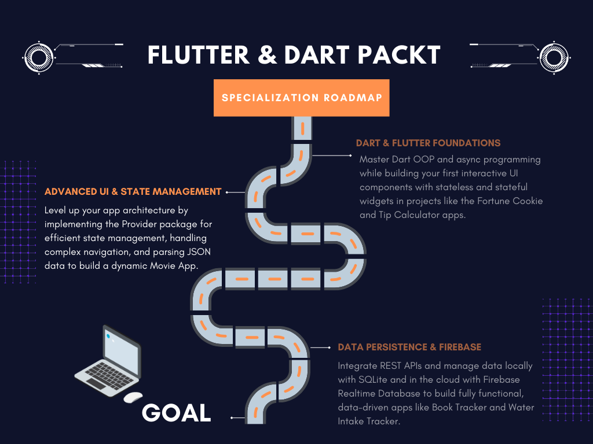

  <h1>⚙️ Phase 2: Advanced Flutter UI & State Management</h1>

  

  

  

  

  
<i>The intermediate phase of the <b>"Flutter & Dart - Complete App Development"</b> Specialization by Packt. This module marks the transition from static screens to dynamic, state-driven architectures, focusing heavily on decoupling business logic from the UI using the Provider package.</i>

 

 

# 📖 Phase Overview

This course elevates application design by introducing professional state management and data modeling. The primary focus is on building scalable, maintainable systems where the UI reacts efficiently to underlying data changes without unnecessary rebuilds.

### 🎯 Core Engineering Objectives
- **State Management Architecture:** Deep integration of the `Provider` package. Understanding the performance implications of `Consumer` vs. `Provider.of`.
- **Data Modeling & Parsing:** Converting raw local `JSON` files into strongly typed Dart objects (Model Classes) using Maps.
- **Advanced Navigation:** Implementing multi-screen routing and securely passing complex object data between active screens.
- **Dynamic UI Rendering:** Handling large datasets efficiently using `ListView.builder`, and building interactive lists with `ListTile` and `ExpansionTile`.
- **Advanced Dart OOP:** Applying core object-oriented principles such as Inheritance and Method Overriding to create clean, reusable widget architectures.
- **Asynchronous Programming:** Utilizing `Future`, `async`, and `await` for smooth data loading states.

 

 

# 🔥 Hands-On Projects

  <table border="0" cellpadding="15">
    <tr>
      <td width="50%" valign="top">
        <h3>🎬 Movie App</h3>
        
A completely new data-driven application. Features dynamic JSON data parsing, mapping data to Dart models, and rendering through a <code>ListView</code>. Demonstrates advanced navigation by passing selected Movie models to a detailed secondary screen.

      </td>
      <td width="50%" valign="top">
        <h3>🔄 Refactored Tip Calculator & Fortune App</h3>
        
Re-engineering Phase 1 projects to eliminate <code>setState()</code>. Implementing <b>Provider</b> to manage application state globally, alongside a <code>ThemeProvider</code> to dynamically toggle between Dark and Light UI modes seamlessly.

      </td>
    </tr>
  </table>

 

 

# 📚 Modules Covered

1. **Provider State Management Package:**
   - Package installation and dependency management.
   - Creating Model Classes for business logic.
   - Implementing `Provider` and `Consumer`.
   - Dynamic Theming (Dark/Light mode).
   - Dart OOP Inheritance and Overrides.

2. **Navigation, JSON Parsing, and ListView:**
   - Working with Dart Arrays, Lists, and Loops.
   - Creating a `MovieParser` class to handle JSON maps.
   - Managing asynchronous operations (`Future`, `async/await`).
   - Advanced UI composition with `CircleAvatar` and Custom Widgets.

 

 

  <h3>🛠️ Technical Tools Used</h3>
  
  
  
  

  

 

  <h3>🗺️ Course Navigation</h3>
  
  
  
    

  
  &nbsp;&nbsp;&nbsp;&nbsp;&nbsp;&nbsp;
  

