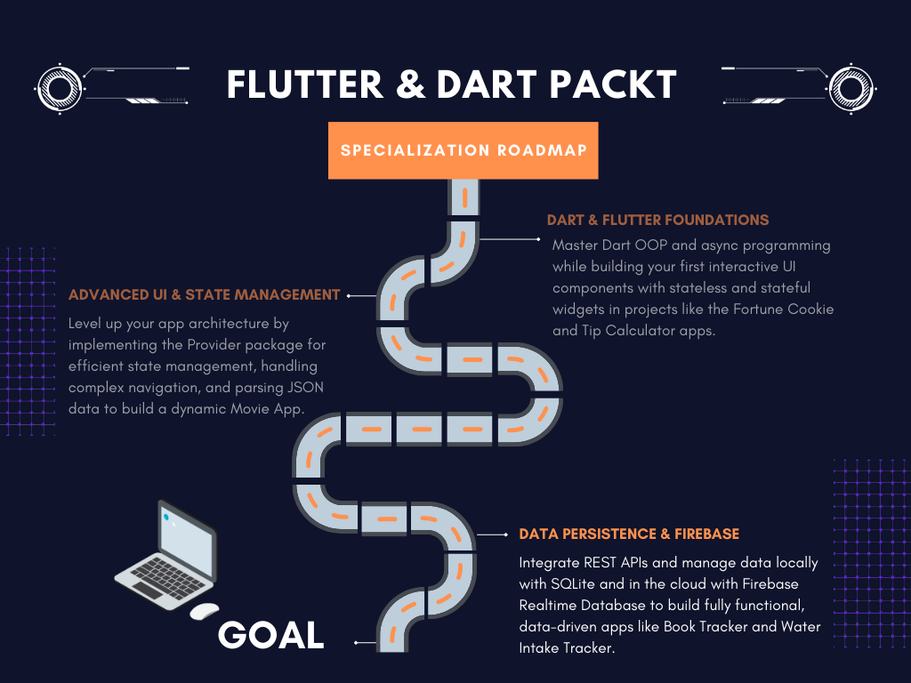

  <h1>☁️ Phase 3: Data Persistence & Firebase Integration</h1>

  

  

  

  

  
<i>The final and most advanced phase of the <b>"Flutter & Dart - Complete App Development"</b> Specialization by Packt. This module focuses on bridging the gap between volatile in-memory state and persistent, structured data using local databases (SQLite), REST APIs, and cloud architecture (Firebase).</i>

 

 

# 📖 Phase Overview

This course transitions development from client-side UI construction to full-stack mobile engineering. The core focus is on data lifecycle management: fetching data from external servers, caching it locally for offline use, and synchronizing user actions with real-time cloud databases.

### 🎯 Core Engineering Objectives
- **RESTful API Integration:** Constructing HTTP requests to consume external data (Google Books API), parsing complex JSON payloads, and mapping them to Dart models.
- **Local Relational Databases (SQLite):** Designing database schemas, creating a Database Helper class, and executing CRUD operations (Create, Read, Update, Delete) for offline data persistence.
- **Cloud Database Integration (Firebase):** Configuring and connecting a Flutter app to Firebase Realtime Database using structured HTTP requests.
- **Advanced Error Handling:** Implementing robust `try-catch` blocks and null-safety principles to prevent app crashes during network failures or missing data.
- **Data Visualization:** Integrating external packages (like `BarChart`) to transform raw database metrics into interactive, visual UI components.
- **Complex UI Architectures:** Managing `GridViews`, advanced `BottomNavigationBar` setups, dynamic visual toggles (Favorite states), and asynchronous UI states (Loading spinners).

 

 

# 🔥 Hands-On Projects

  <table border="0" cellpadding="15">
    <tr>
      <td width="50%" valign="top">
        <h3>📚 Book Tracker App</h3>
        
A comprehensive library management app. Fetches live data from the <b>Google Books API</b>. Implements <b>SQLite</b> for local caching, allowing users to save books, manage a 'Favorites' list offline, and interact with complex grid/list UI combinations.

      </td>
      <td width="50%" valign="top">
        <h3>💧 Water Intake Tracker</h3>
        
A health monitoring app synchronized with the cloud. Utilizes <b>Firebase Realtime Database</b> via HTTP for remote data storage. Features state management with <b>Provider</b> to instantly reflect DB changes on the UI, and visualizes weekly data using dynamic Bar Charts.

      </td>
    </tr>
  </table>

 

 

# 📚 Modules Covered

1. **APIs & SQLite Database (Book Tracker):**
   - Setting up `BottomNavigationBar` and multi-screen architecture.
   - Network requests to Google Books API endpoint.
   - Dart Control Flow, Exception handling, and Null Safety.
   - Creating an SQLite Database Helper class (Tables, Insert, ReadAll, Delete).
   - Dynamically toggling Favorite/Save states based on database checks.

2. **Firebase Realtime Database (Water Tracker):**
   - Firebase backend configuration.
   - POST/GET requests to Firebase using HTTP.
   - Integrating Provider with HTTP requests for UI synchronization.
   - Handling asynchronous database issues and ID mapping.
   - Data visualization: Creating and customizing BarGraphs based on daily summaries.

 

 

  <h3>🛠️ Technical Tools Used</h3>
  
  
  
  

  

 

  <h3>🗺️ Course Navigation</h3>
  
  
  
    

  

