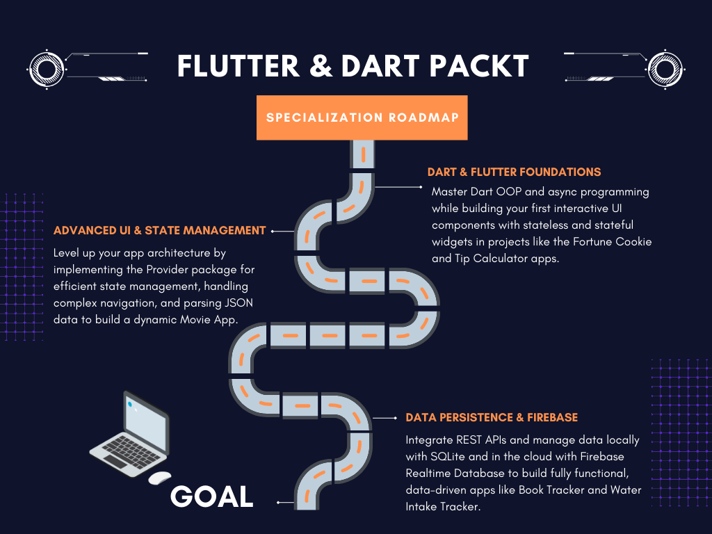

  <h1>📱 Flutter & Dart Specialization Packt</h1>

  

  

  

  

  
<i>A comprehensive repository documenting my hands-on journey through the <b>"Flutter & Dart - Complete App Development"</b> Specialization by Packt on Coursera. This monorepo contains all the projects, source code, and study notes from mastering Dart OOP to full-stack Firebase integration.</i>

 

 

# 📚 Course Series Breakdown

### 1️⃣ Phase 1: Getting Started with Flutter & Dart

Focused on the core fundamentals of the Dart programming language and the Flutter framework environment.

- 🎯 **Key Learnings:** Flutter environment setup, Dart basics (Variables, Functions, OOP), Asynchronous programming, Widget tree, and Stateful vs. Stateless widgets.
- 🚀 **Projects Built:** Fortune Cookie App, Tip Calculator (V1).

---

### 2️⃣ Phase 2: Advanced Flutter UI and State Management

Transitioned from basic static UIs to managing complex app states and parsing external data.

- 🎯 **Key Learnings:** Deep dive into the `Provider` package, dynamic theming (Dark/Light modes), JSON parsing, dynamic lists with `ListView`, complex navigation, and Dart OOP (Inheritance, Overriding).
- 🚀 **Projects Built:** Refactored Tip Calculator (with Provider & Theming), Movie App.

---

### 3️⃣ Phase 3: Data Persistence and Firebase Integration

Covered local and cloud data storage, transforming static apps into persistent, dynamic applications.

- 🎯 **Key Learnings:** Local storage using `SQLite`, integrating `Firebase Realtime Database` via HTTP requests, consuming RESTful APIs (Google Books API), robust exception handling, and data visualization (Bar Charts).
- 🚀 **Projects Built:** Book Tracker App, Water Intake Tracker App.

 

 

# 🔥 Key Projects Portfolio

  <table border="0" cellpadding="15">
    <tr>
      <td width="50%" valign="top">
        <h3>📚 Book Tracker App</h3>
        
Utilizes the <b>Google Books API</b> to fetch data and <b>SQLite</b> for local caching and favorites management. Features complex navigation and grid/list UI combinations.

      </td>
      <td width="50%" valign="top">
        <h3>💧 Water Intake Tracker</h3>
        
A real-time synchronized app using <b>Firebase Realtime Database</b>. Implements dynamic UI updates, custom settings, and data visualization using the <code>BarChart</code> package.

      </td>
    </tr>
    <tr>
      <td width="50%" valign="top">
        <h3>🎬 Movie App</h3>
        
Focuses on consuming local JSON data files, parsing maps, and advanced screen navigation with data passing.

      </td>
      <td width="50%" valign="top">
        <h3>💵 Tip Calculator</h3>
        
Built initially with basic state, then heavily refactored to utilize the <b>Provider</b> package for state and theme management (Dark/Light mode toggles).

      </td>
    </tr>
  </table>

 

 

# 💻 Technical Arsenal & Skills Gained

  <h3>🧠 Architecture & State Management</h3>
  
  

  

  <h3>🌐 Networking & Data Handling</h3>
  
  
  

  

  <h3>🔥 Cloud Services & UI Tools</h3>
  
  
  

 

 

<h3 align="center">🤝 Let's Connect</h3>

  Got a question about this repository, architecture, or Flutter development? Feel free to reach out!

  
  
  

 

<i>Developed & Engineered by</i>

  <h3>Amr Fathy Elsherif</h3>
  
Software Engineer | Mobile & Backend Systems

  
Alexandria, Egypt

